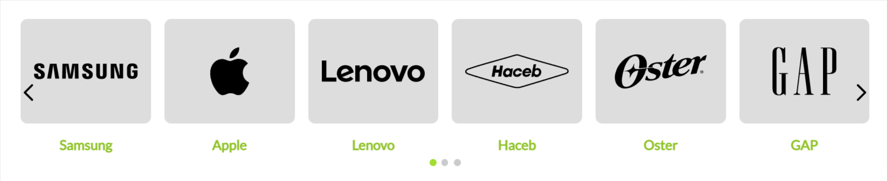

# Bullets diagramation

Elemento de contexto que muestra los niveles inferiores de navegación dentro de una lista de viñetas con imágenes.

## Configuración 

### Paso 1: Clonar Proyecto

Clonar este [repositorio](https://github.com/juliflorezg/itgloberspartnercl-categories-diagramation) en su equipo.

#### Paso 2 : Editar el Manifest.json

Una vez clonado el repositorio debe editar los siguientes campos en el archivo `Manifest.json`: 
 - vendor
 - name
 - title
 - version
  
Por ejemplo: 

    "vendor": "itgloberspartnercl",
    "name": "bullets-diagramation",
    "version": "0.0.1",
    "title": "Bullets Diagramation",
    "description": "elements context that allows rendering low level categories",

De igual manera debe configurar los archivos `package.json` con editando `name` y `versión`

Compruebe que el proyecto cuenta con todos los builders y dependencias necesarias. Este proyecto funciona con: 

    "builders": {
      "react": "3.x",
      "messages": "1.x",
      "docs": "0.x",
      "store": "0.x"
    },  

    "dependencies": {
      "vtex.native-types": "0.x",
      "vtex.list-context": "0.x",
      "vtex.device-detector": "0.x",
      "vtex.css-handles": "0.x"
    },

### Paso 3: Instalar node-modules

Usando la terminal, acceda a la carpeta `React` que se encuentra dentro de su repositorio por medio del comando `cd react` y ejecute el comando : `yarn install` el cual va a instalar las dependencias necesarias. Una vez instalado vuelva al repositorio base con `cd ..`

### Paso 4: Ejecutar el Preview de la tienda.

En este paso se recomienda ejecutar `vtex whoami` para comprobar si se encuentra en su propio `workspace` de desarrollo.

Una vez comprobado, ejecute el comando `vtex link` dentro de la raíz de su proyecto. Este proceso instalará y vinculará nuestro componente custom a nuestro proyecto base. Si no ocurre ningún error la consola mostrara el mensaje: `App linked successfully`

### Paso 5: Usar Componente custom en tienda base

Para usar este componente custom en su tienda base es importante importarla en su proyecto base dentro de `peerDependencies`: 
Ej: vendor.name: version
  
    "peerDependencies": {
      "itgloberspartnercl.bullets-diagramation": "0.x"
     },

### Contributors

1. [Julian Florez](https://github.com/juliflorezg/)
